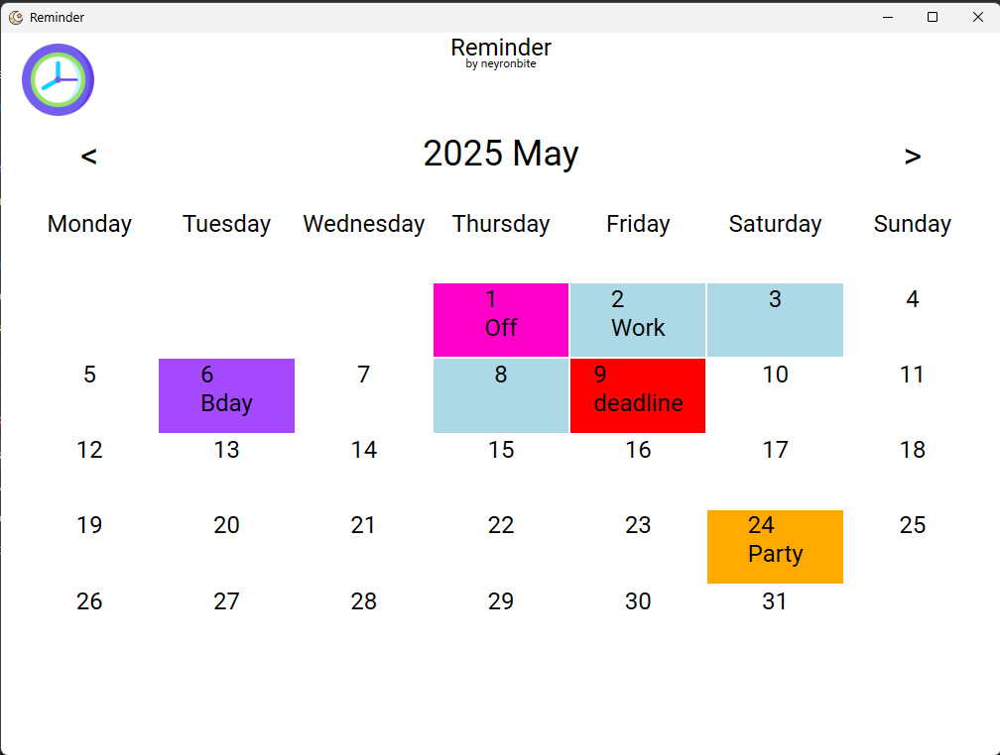

# Reminder

**Reminder** is a lightweight and minimalist calendar application designed to help you stay on top of your daily tasks and scheduled events. Created with .NET Framework 4.7.2 and built for Windows, this tool combines a traditional calendar interface with timed notifications — functioning like an alarm.

## Features

- 📅 **Monthly Calendar View**  
  Browse any month and click on individual days to view or add notes and events.

- 📝 **Day Notes**  
  Add custom notes to any day — use it like a journal or a daily to-do list.

- ⏰ **Timed Events with Notifications**  
  Add events with specific time (e.g. "2:00 PM") — Reminder will notify you at the exact time, even if it's minimized.

- ✅ **Enable/Disable Events**  
  Toggle event visibility with a simple checkbox.

- 💾 **SQLite Powered Persistence**  
  All your notes and events are saved locally via SQLite. Data is retained between sessions.

- 🚀 **Auto-start on Windows**  
  Automatically launch Reminder on system boot (requires admin permissions).

- 🧭 **Lightweight and Fast**  
  The app runs in the background without hogging system resources.

## Screenshots

### Calendar View  
Browse dates and see marked notes/events:

### Day Details  
See and manage notes and timed events for any selected day:

## Installation

1. Download the latest release from GitHub:  
   👉 [Reminder v1.1 on GitHub](https://github.com/Neyronbite/Reminder/releases/tag/v1.1)

2. Extract the ZIP file.

3. Run the `install.bat` script.

## Development

- **Platform**: .NET Framework 4.7.2  
- **UI Framework**: WPF  
- **Database**: SQLite

## License

This project is free to use and modify. No license yet — use at your own risk.
